# Reverse Document

[](http://www.yangziyao.top)
[](https://weibo.com/5905837515/profile?topnav=1&wvr=6)
[](https://opensource.org/licenses/mit-license.php) 
[](https://github.com/CodyCalvin/WebCrawler) 

逆向工程的目的
-----
1. 分析竞品的最新研究或者产品原型（包括所用的技术，所使用的框架）

2. 有助于进一步的认识iOS从而提升自己／学习目的。

3. 破解应用的使用权限

4. 识别竞品潜在的侵权行为

逆向工程的分析工具
------

* 进行iOS逆向工程的一个关键就是工具的使用，工欲善其事，必先利其器。


|工具分类|  工具名称  |
| -----|:---------:|
|越狱工具| [盘古越狱](http://www.pangu.io) |
|查看文件工具| [PP助手](https://pro.25pp.com)，[iExplorer](https://iexplorer.en.softonic.com)，[iFunbox](http://www.i-funbox.com/zh-cn_index.html)，[iTool](https://www.itools.cn)|
|砸壳工具| [dumpdecrypted](https://github.com/stefanesser/dumpdecrypted)，[Clutch](https://github.com/KJCracks/Clutch)|
|查看头文件工具| [class-dump](https://github.com/nygard/class-dump)|
|反汇编工具| [Hopper](https://www.hopperapp.com)，[IDA Pro](https://www.hex-rays.com)|
|调试器| [HCycript](http://iphonedevwiki.net/index.php/Cycript_Tricks "插件Cydia安装")，[gdb](http://www.gnu.org/software/gdb/ "插件Cydia安装")|
|UI分析工具| [Reveal](https://revealapp.com)|
|网络分析工具| [Charles](https://www.charlesproxy.com)|

1.准备阶段
-------

先上 iOS 逆向的三板斧，这是每次要逆向破解前都需要做的步骤。如果你不了解iOS逆向的话你可以参考一下文章[iOS逆向工程准备工作](https://www.jianshu.com/p/0cb76f7203b3)或者阅读[iOS应用逆向工程](https://book.douban.com/subject/25826902/)书籍当然也有PDF版[iOS应用逆向工程pdf版](http://www.cocoachina.com/bbs/read.php?tid-1677433.html)

首先，请确保你的手机已经越狱，同时已经安装好 theos 开发环境，当然如果你做的`Tweak`比较简单的话那么你可以使用[MokeyDev](https://github.com/AloneMonkey/MonkeyDev)来开发调试。

2.砸壳
-------

如果是从 AppStore 上面下载的 App，都要先进行砸壳，否则是没办法进行下一步的。如果你懒得做这一步，就直接去其它助手类应该上面进行下载，那些都是砸过壳的，可以直接使用。

砸壳可以使用的工具有两种：

[dumpdecrypted](https://github.com/stefanesser/dumpdecrypted)，使用方法请参考[dumpdecrypted砸壳](http://www.swiftyper.com/2016/05/02/iOS-reverse-step-by-step-part-1-class-dump/)

[Clutch](https://github.com/KJCracks/Clutch)，使用方法请参考[Clutch砸壳](http://www.swiftyper.com/2016/12/26/wechat-redenvelop-tweak-for-non-jailbroken-iphone/)

大多数App可以直接在PP助手在这里，我们这里以逆向陌陌为例就直接用PP助手下载陌陌越狱版省去砸壳步骤.具体流程请看下图
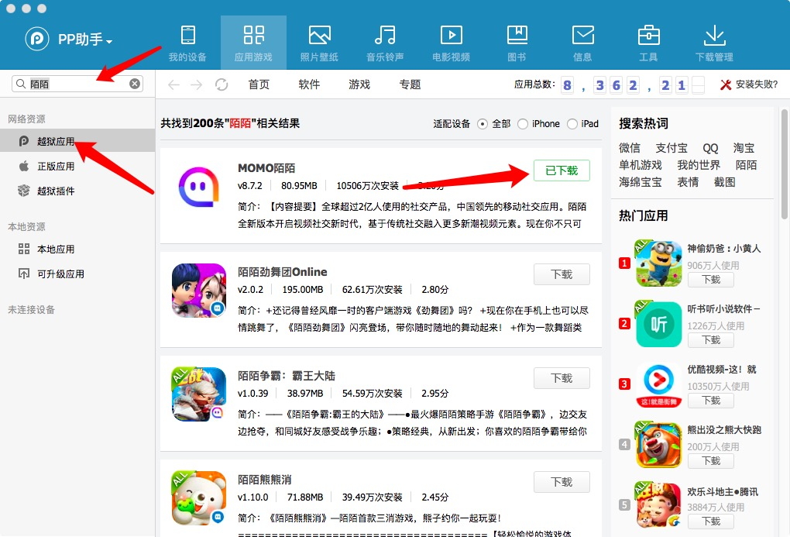

3.创建工程
-------


这里我们没有越狱手机那么我们首先要配置好[MokeyDev](https://github.com/AloneMonkey/MonkeyDev)然后我们打开`Xcode`创建一个新的工程我们选择`MokeyApp`

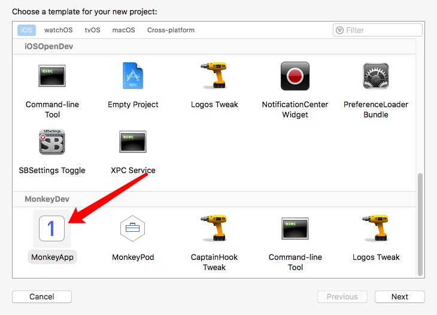

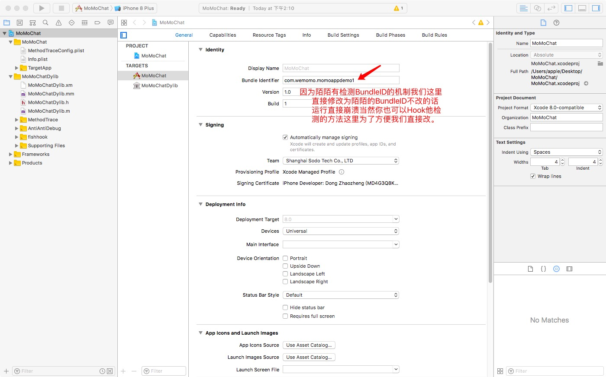

此时我们打开项目文件把我们下载的越狱版陌陌ipa安装包放到项目下的`TargetApp`目录下

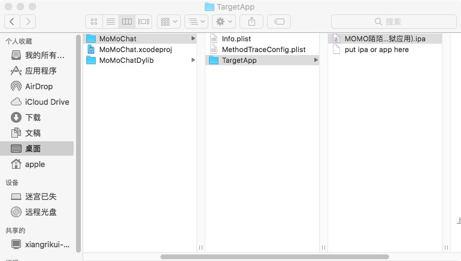

此时我们运行项目就可以看到陌陌啦  注意:只能用真机模拟器无法运行.

4.思路
-------

hook一个APP最难的不是代码，往往是分析出合适的切入点。

比如我们想抓取陌陌关注里边的视频列表那我们就可以先从界面切入分析.

这时我们就用到了UI页面分析神器[Reveal](https://revealapp.com)运行项目然后把手机页面调至我们想分析的页面然后打开[Reveal](https://revealapp.com)

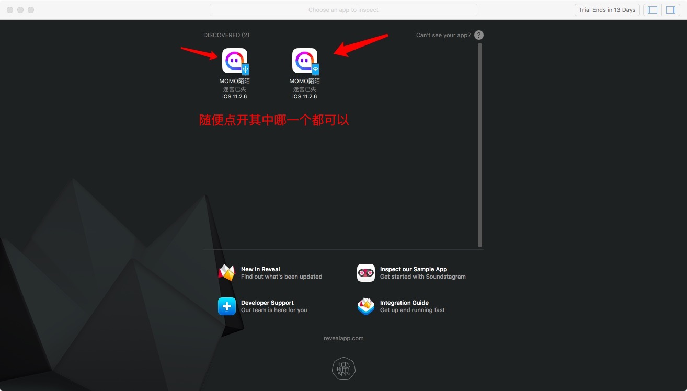
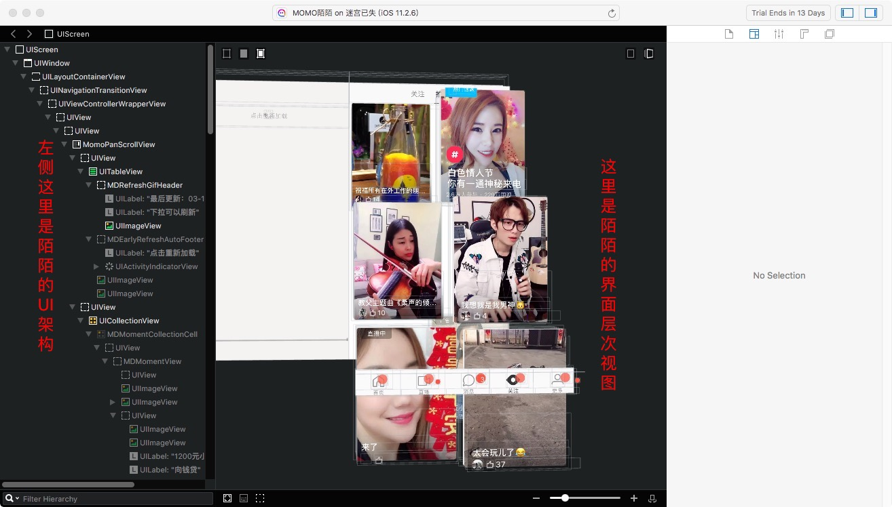

打开之后我们会看到陌陌的视图的层次结构左边部分是陌陌的结构中间是视图我们找到想要分析的界面点击此界面然后看下图
-----
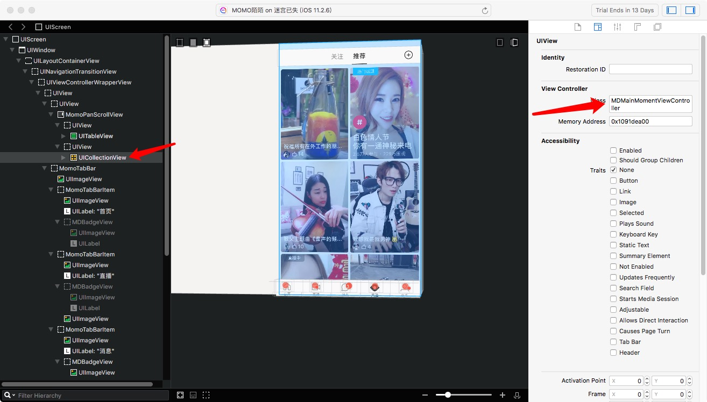
我们看到右侧的视图Class项确定了这个视图是属于哪个类的，下面我们就需要把陌陌的头文件导出来找到对象的Class然后进行分析Hook.

5.导出.h文件
导出头文件这里我们就要用到[class-dump](https://github.com/nygard/class-dump)如果没配置的话可以参考[Class-dump配置](http://blog.csdn.net/wm9028/article/details/52021061)此时们可以在桌面创建一个文件夹(命名随意)然后打开`ITerm(终端)`输入以下命名行

```java 
class-dump -H 陌陌.app文件的路径 -o 生成头文件存放的路径
```

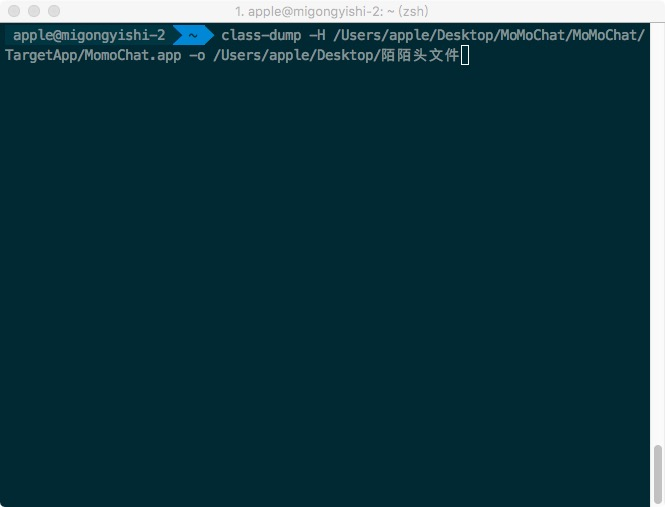

然后敲击回车运行等待完成即可此时头文件已全部导出

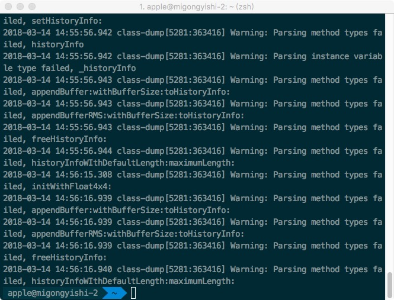

5.分析
------

* 此时打开我们刚才导出的头文件找到我们之前分析到的`MDMainMomentViewController.h`文件

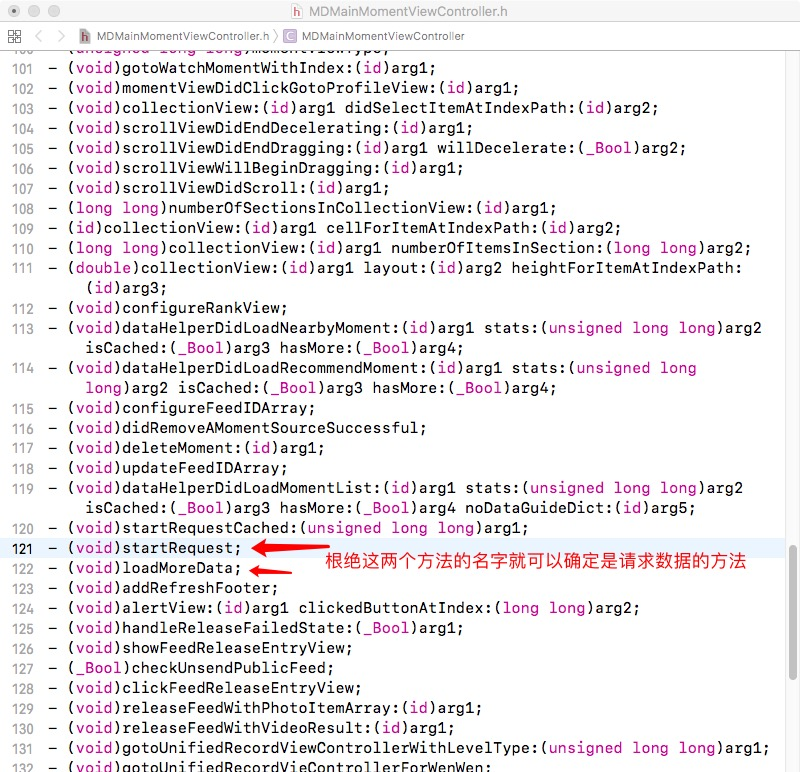

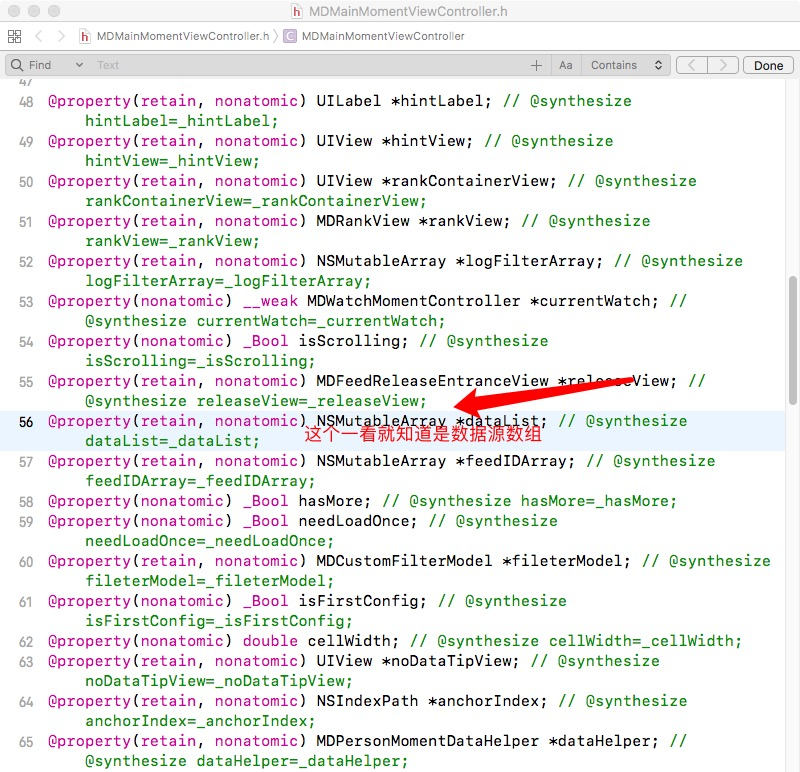
这正是我们要切入的那个点，下边我们就开始编写Tweak进行分析。

6.开始Hook
------

* 我们已经找到了切入点，下边我们就要Hook此方法然后通过oc语言的Rtuntime特性进行下断点分析。

我们使用`MonkeyDev`使用的是[CaptainHook](https://github.com/rpetrich/CaptainHook)语法，如果你不太了解[CaptainHook](https://github.com/rpetrich/CaptainHook)语法的话你可以参考[CaptainHook语法](https://www.cnblogs.com/lkislam/p/4781011.html)文章.

然后我们打开工程开始编写代码进行函数替换编写好的代码如下图会正向开发的下边代码都能看懂.

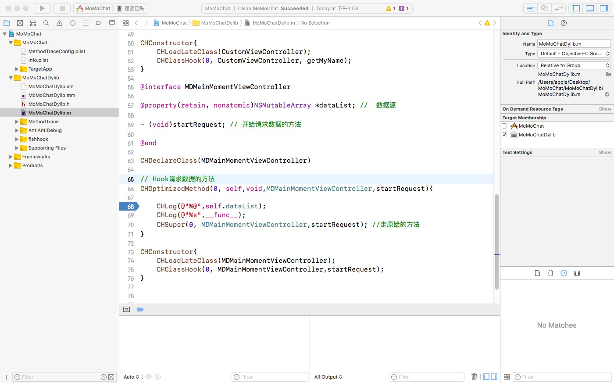

然后我们运行代码打开手机等待项目运行起来打开我们视频推荐列表然后下来一下然后App请求数据自然会走`startRequest`函数我们已经Hook了然后
会停到我们下断点的地方这时候我们就开始下一步的分析.

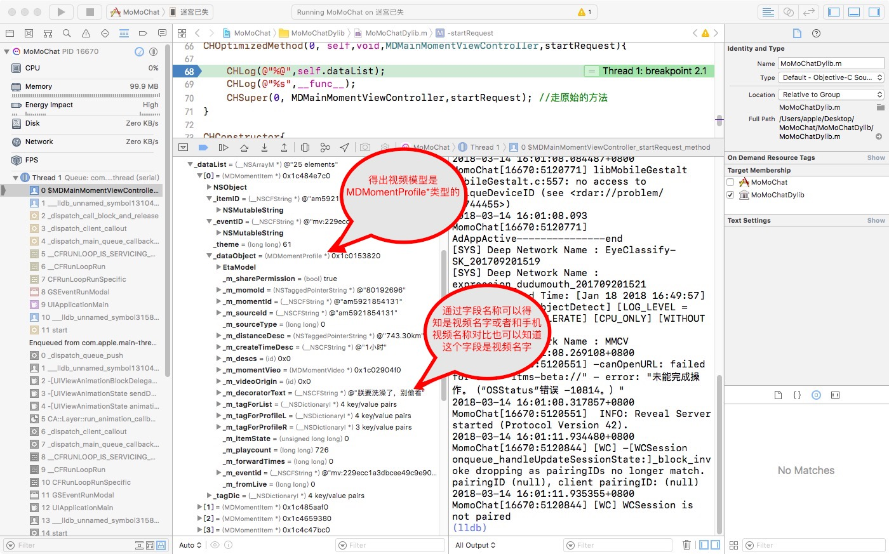

* 我们已经找到了切入点，下边我们就要Hook此方法然后通过oc语言的Rtuntime特性进行下断点分析。是
* 我们已经找到了切入点，下边我们就要Hook此方法然后通过oc语言的Rtuntime特性进行下断点分析。
